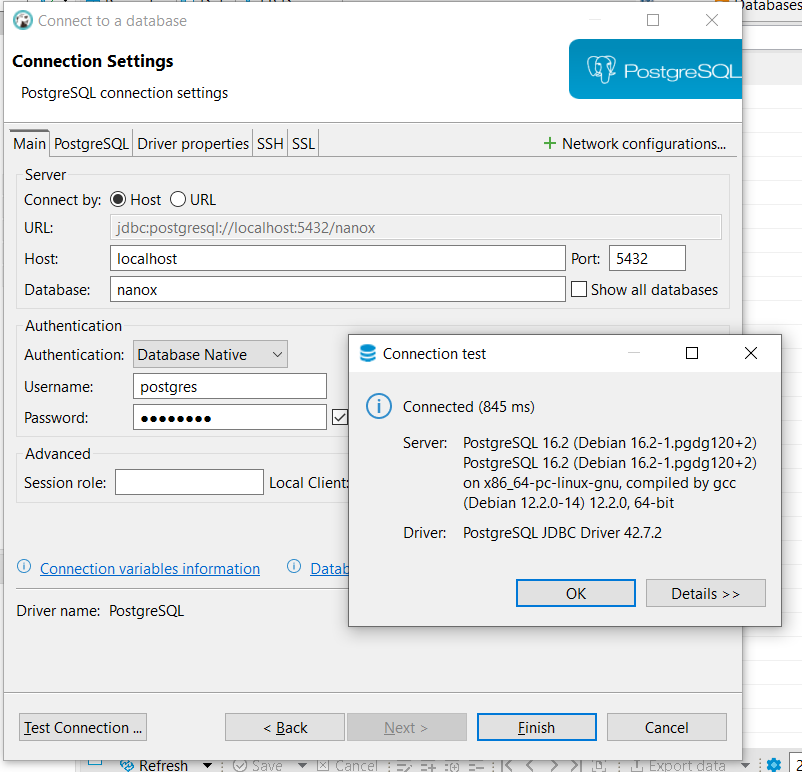
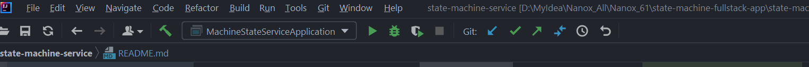
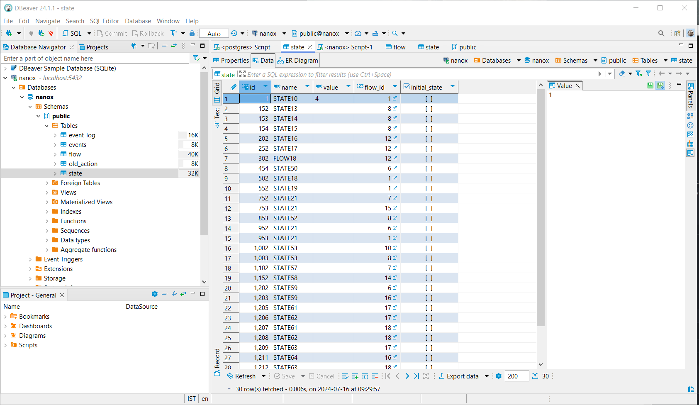
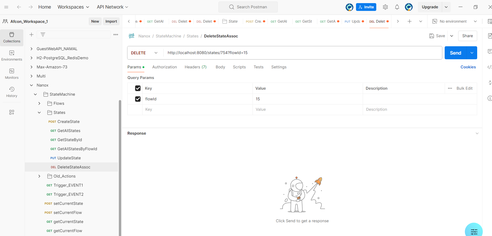

# Michael-Trembovler-Machine-state-service

# Release notes:
## The easiest way is to run the server side of the application via Docker:

- Navigate to state-machine-service directory, then:

``` 
    state-machine-service> docker-compose up --build
```

```
D:\>docker ps
CONTAINER ID   IMAGE                          COMMAND                  CREATED             STATUS             PORTS                    NAMES
...
6a6850c03912   machine-state-service:latest   "java -jar /app/mach…"   5 hours ago         Up 5 seconds       0.0.0.0:8080->8080/tcp   state-machine-service-backend-1
603caf611e43   postgres:13                    "docker-entrypoint.s…"   5 hours ago         Up 9 seconds       0.0.0.0:5433->5432/tcp   state-machine-service-postgres-1
5a135b7b359f   postgres                       "docker-entrypoint.s…"   2 weeks ago         Up About an hour   0.0.0.0:5432->5432/tcp   core-db-1

```
- state-machine-service-backend-1 - the container ID: 6a6850c03912 with java backend app.
- state-machine-service-postgres-1 - the ID: 603caf611e43 postgres:13 separate database uses as production db **port 5433->5432**.
- core-db-1 - container with ID: 5a135b7b359f contains a development database port 5432.

## To top the servers side:

```
 state-machine-service>docker-compose down
```

## When launched through the development environment, be sure to strictly follow this order, although it is quite standard.

- Change back  the port in the application.properties file from 5433 to 5432:
  Because my postgresql database used for development is running in another docker container core-db-1 on port 5432.
```  
    spring.datasource.url=jdbc:postgresql://localhost:5432/nanox
```

- First of all, you will need a Postgres database installed in docker container.
  Required PostgreSQL image: postgres:latest
- launch container with postgres (in my case it calls core-db-1, the name has been done by k8s):
``` 
   C:\Users\michael>docker ps
CONTAINER ID   IMAGE                       COMMAND                  CREATED          STATUS          PORTS                    NAMES
...
5a135b7b359f   postgres                    "docker-entrypoint.s…"   2 weeks ago      Up 45 minutes   0.0.0.0:5432->5432/tcp   core-db-1
```

- Via terminal:
```
psql -h localhost -p 5432 -U postgres

Enter the password when prompted:
Password for user postgres: postgres

Then, in the psql interactive terminal, run:

``` typescript

    CREATE DATABASE nanox
    WITH
    OWNER = postgres
    ENCODING = 'UTF8'
    LC_COLLATE = 'en_US.utf8'
    LC_CTYPE = 'en_US.utf8'
    TABLESPACE = pg_default
    CONNECTION LIMIT = -1;
    
\q
```


- Next, you'll need DBeaver to make your database easier to visualize:
- **Connect the database**

  


```
  localhost:5432/nanox
  username=postgres
  password=postgres
```


- **Open the state-machine-service (server side project) in Intellij Idea 2024 Community edition.**

  

- **Run through Intellij Idea.**

```
 mvn clean,compile, install
``` 

- **Then launch MachineStateServerApplication from the Intellij top menu (as usual).**


  


# ATTENTION !!!  Without the databases running, the build will not succeed.


- **The application itself creates all the tables, 
    table data will be filled in as user input via UI**

  


# Postman collection: 
- **Need have Postman installed . Then need import request collection from the file Nanox.postman_collection.json**




# Tests
Provided tests are a combination of both, utilizing JUnit for the test infrastructure and assertions, 
and Mockito for mocking dependencies and specifying their behaviors. This combination is a 
common practice in unit testing for Java applications, 
allowing for more focused and isolated tests.

To run tests use command:  
```
  mvn test -Dtest=StateMachineServiceTests
```

or via Maven test.


# Flows and States:
- The same state can be associated with different flows.
  - The query below selects the following multi-associated states:
```
  SELECT
  s.name AS state_name,
  COUNT(DISTINCT f.name) AS flow_count
  FROM
  flow f
  INNER JOIN
  state s
  ON
  f.id = s.flow_id
  GROUP BY
  s.name
  HAVING
  COUNT(DISTINCT f.name) > 1;
```